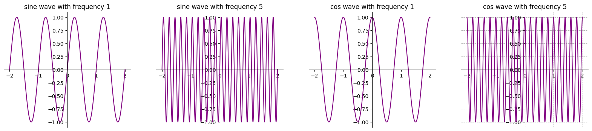
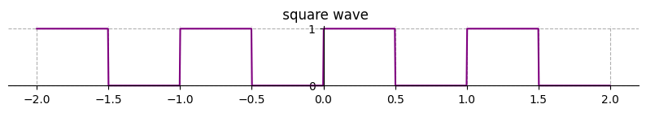
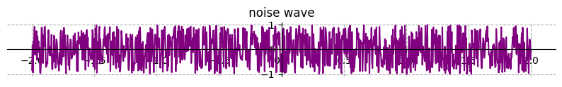
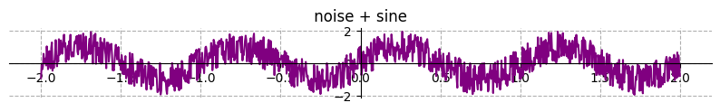
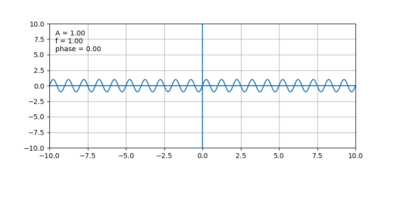
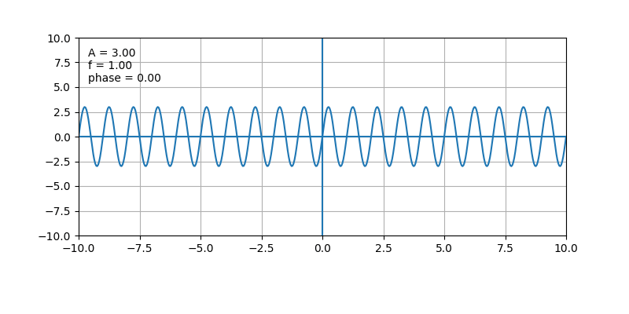

# Wireless Communications Research

A structured research and learning repository covering wireless communications, digital signal processing, communication systems, channel modeling, and software defined radio (SDR).

The repository documents the progression from fundamental signal concepts to practical communication-system experiments, using mathematical analysis, Python implementation, simulation, visualization, and documentation.

---

## Table of Contents

- [Objectives](#objectives)
- [Methodology](#methodology)
- [Progress](#progress)
- [Repository Structure](#repository-structure)
- [Research Areas](#research-areas)
- [Projects](#projects)
- [Roadmap](#roadmap)
- [Tools and Technologies](#tools-and-technologies)
- [Current Status](#current-status)
- [License](#license)

---

## Objectives

The goal is to build a strong engineering foundation in wireless communications through:

- Mathematical foundations
- Signal and system analysis
- Digital Signal Processing (DSP)
- Digital communications
- Wireless channel modeling
- Modulation and demodulation
- OFDM and MIMO
- Software Defined Radio (SDR)
- Adaptive communications
- Machine learning for communications
- Practical simulations and experiments

The repository is developed progressively, with each stage combining theory with implementation and visualization.

---

## Methodology

Every topic follows the same workflow, with the aim of understanding the mathematical and physical meaning behind each algorithm rather than only implementing it.

| Step | Stage                      |
|:----:|----------------------------|
| 1    | Theory                     |
| 2    | Mathematical representation|
| 3    | Python implementation      |
| 4    | Visualization              |
| 5    | Experiment                 |
| 6    | Analysis                   |
| 7    | Documentation              |

---

## Progress

### Day 1 — Signal Types

The first experiment focused on the fundamental representation and visualization of signals in Python.

**Topics covered**

- Continuous-time and discrete-time signals
- Deterministic and random signals
- Periodic signals
- Sine waves, square waves, and random noise
- Adding noise to a sine wave

**Tools:** Python, NumPy, Matplotlib, Jupyter Notebook

**Notebook:** [`signals/examples/01_signal_types.ipynb`](signals/examples/01_signal_types.ipynb)

**Results**

<table>
  <tr>
    <td align="center" width="50%">
      <br>
      <sub><b>Fig. 1.1</b> — Sine and cosine signals</sub>
    </td>
    <td align="center" width="50%">
      <br>
      <sub><b>Fig. 1.2</b> — Square wave</sub>
    </td>
  </tr>
  <tr>
    <td align="center" width="50%">
      <br>
      <sub><b>Fig. 1.3</b> — Random noise</sub>
    </td>
    <td align="center" width="50%">
      <br>
      <sub><b>Fig. 1.4</b> — Sine wave with additive noise</sub>
    </td>
  </tr>
</table>

---

### Day 2 — Amplitude, Frequency, Phase, Period, and Angular Frequency

The second experiment studied the fundamental parameters of a sinusoidal signal and their effect on the waveform:

$$x(t) = A\sin(2\pi f t + \phi)$$

**Topics covered**

- Amplitude $A$
- Frequency $f$
- Phase $\phi$
- Period $T$
- Angular frequency $\omega$

**Key relationships**

$$T = \frac{1}{f} \qquad\qquad \omega = 2\pi f$$

Therefore the signal can also be written as:

$$x(t) = A\sin(\omega t + \phi)$$

**Parameter summary**

| Parameter         | Symbol   | Unit      | Effect on the waveform                                   |
|-------------------|:--------:|:---------:|----------------------------------------------------------|
| Amplitude         | $A$      | —         | Sets the vertical magnitude; frequency is unchanged      |
| Frequency         | $f$      | Hz        | Number of complete cycles per second                     |
| Phase             | $\phi$   | rad       | Angular position within the cycle (horizontal shift)     |
| Period            | $T$      | s         | Time for one complete cycle, $T = 1/f$                   |
| Angular frequency | $\omega$ | rad/s     | Rate of phase change, $\omega = 2\pi f$                  |

For example, $\sin(\theta)$ and $\sin(\theta + \pi/2)$ have the same amplitude and frequency but differ in phase.

**Interactive experiment**

Day 2 was implemented as an interactive notebook in which the signal parameters can be changed and their effects observed directly.

**Notebook:** [`signals/examples/02_amplitude_frequency_phase_period_angular_frequency.ipynb`](signals/examples/02_amplitude_frequency_phase_period_angular_frequency.ipynb)

**Results**

<table>
  <tr>
    <td align="center" width="33%">
      <br>
      <sub><b>Fig. 2.1</b> — Amplitude variation</sub>
    </td>
    <td align="center" width="33%">
      <br>
      <sub><b>Fig. 2.2</b> — Frequency variation</sub>
    </td>
    <td align="center" width="33%">
      <br>
      <sub><b>Fig. 2.3</b> — Phase variation</sub>
    </td>
  </tr>
</table>

---

## Repository Structure

```text
wireless-communications-research/
├── adaptive_comms/      coding, equalization, experiments, link_adaptation, modulation
├── benchmarks/
├── career/              portfolio, project_descriptions, resume
├── channel_models/      awgn, doppler, examples, fading, multipath
├── digital_comms/       decoding, demodulation, encoding, examples, modulation, synchronization
├── dsp/                 equalization, estimation, examples, filters, sampling, synchronization
├── experiments/
├── figures/
├── gnuradio/            blocks, experiments, flowgraphs
├── mimo/                beamforming, channel, detection, examples, precoding
├── ml_for_comms/        datasets, experiments, features, models
├── modulation/          ask, examples, fsk, psk, qam, qpsk
├── ofdm/                channel_estimation, core, equalization, examples, receiver, transmitter
├── projects/            project_01_ofdm, project_02_mimo, project_03_uwa, project_04_adaptive_uwa
├── reports/             experiments, technical
├── sdr/                 calibration, experiments, hardware, receiver, transmitter
├── signals/             examples, visualization
├── src/wireless_lab/
├── tests/               integration, system, unit
├── underwater/          acoustics, channel, experiments, modem
└── wireless/            antenna_models, examples, interference, link_budget, propagation
```

---

## Research Areas

| Area                              | Scope                                                                                  |
|-----------------------------------|----------------------------------------------------------------------------------------|
| Signals and Systems               | Signal representation, generation, visualization, and analysis                         |
| Digital Signal Processing         | Sampling, filtering, synchronization, estimation, equalization, frequency-domain analysis |
| Digital Communications            | Encoding, modulation, demodulation, decoding, synchronization, system simulation       |
| Wireless Communications           | Propagation, antenna models, interference, link-budget analysis, channel behavior      |
| Modulation                        | ASK, FSK, PSK, QPSK, QAM                                                               |
| OFDM                              | Transmitter, receiver, channel estimation, equalization                                |
| MIMO                              | Channels, detection, beamforming, precoding                                            |
| SDR                               | Hardware, transmitters, receivers, calibration, experiments                            |
| Adaptive Communications           | Link adaptation, adaptive modulation, coding, equalization                             |
| Machine Learning for Comms        | Datasets, feature extraction, models, ML-based experiments                             |
| Underwater Communications         | Acoustics, channels, modems, experiments                                               |

---

## Projects

Larger experiments are organized under `projects/`:

| Project                  | Focus                                   |
|--------------------------|-----------------------------------------|
| `project_01_ofdm`        | OFDM system                             |
| `project_02_mimo`        | MIMO system                             |
| `project_03_uwa`         | Underwater acoustic communications      |
| `project_04_adaptive_uwa`| Adaptive underwater acoustic communications |

Each project is organized into source code, experiments, tests, results, figures, benchmarks, and documentation.

---

## Roadmap

Upcoming stages, in approximate order:

1. Sampling, aliasing, and signal reconstruction
2. Noise and SNR
3. Fourier analysis and FFT
4. Digital modulation and demodulation
5. Communication channels: AWGN, fading, multipath, Doppler
6. Synchronization and equalization
7. OFDM
8. MIMO
9. SDR
10. Wireless communication experiments

---

## Tools and Technologies

- Python, NumPy, Matplotlib, Jupyter Notebook
- MATLAB / Simulink (planned)
- GNU Radio (planned)
- SDR hardware (planned)

Additional libraries and tools will be introduced as each experiment requires.

---

## Current Status

| Day | Topic                                              | Status      |
|:---:|----------------------------------------------------|:-----------:|
| 1   | Signal types                                       | Completed   |
| 2   | Amplitude, frequency, phase, period, angular frequency | Completed |
| 3   | Sampling and aliasing                              | In progress |

This repository is an ongoing engineering learning and research project. Each experiment is documented so that its assumptions, results, and observations can be reproduced and reviewed.

---

## License

This repository is intended for educational, research, experimentation, and portfolio purposes.
